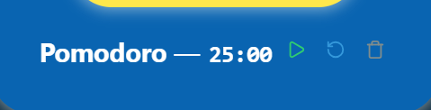

# Actividad 5. Tema 3. React

**PROGRAMACIÓN WEB**

**Alumna**: Pliego Méndez Alondra 

## Explicación

Para la creación de este mini proyecto se tomo como base el código del ToDo del video del curso básico de React y se fueron añadiendo modificaciones, además de tomar la lógica para la creación de las funciones del temporizador de otras fuentes que se encuentran referenciadas en la parte final del documento.
### Componentes
#### Funcional simple
Como componente funcional simple encontramos al Configurador el cual se encarga de dar un determinado formato para que la presentación sea como la de un reloj, primero calcula la cantidad de minutos completos, después utilizando el operador de modulo toma el resto de segundos que sobran, para que cuando se renderize ambos aparezcan de la siguiente forma.

#### Componente que recibe y muestra props
En el componente del formulario, cuando manda a llamar a la funcion agregar temporizador que se encuentra dentro de la lógica principal del mini proyecto, ya que en este caso le envia los datos que el recibio desde los inputs. Los props tambien suceden en el componente "Configurador" porque recibe la cantidad de segundos totales y en base a esto genera un formato de reloj para el despliegue del tempo.
#### Componente que use useState
Se utiliza, principalmente para la parte del temporizador, en donde podemos ver que cada vez que se va restando un segundo o cuando presiono el boton de encendido o apagado, automaticamente se modifica el estado del reloj, todo va sucediendo en tiempo real.
#### Lista renderizada dinámicamente
Tiene la misma lógica del proyecto base ToDo, en este caso el .map() toma un arreglo de los temporizadores que se van creando y por cada uno lo va añadiendo a la lista con sus respectivos botones. Facilita el no tener que estar creando cada uno de estos manualmente o con un proceso más largo.
## Cuestionario
a) ¿Qué diferencia hay entre props y state en React?
En props(viende de propiedades) la información viaja de un componente padre a un componente hijo. Mientras que el state va a gestionar datos que pueden ser modificados con el tiempo y cambiar la interfaz de usuario cuando esto suceda. Entonces la principal diferencia es que Props recibe información de un componente externo que no puede ser modificada por el mismo, mientras que por el contrario State la información es misma del componente y controlable por el mismo, además de que puede cambiar como respuesta a ciertos eventos. 
b) ¿Por qué es importante usar una key al renderizar una lista de elementos?
Porque proporciona un identificador único en cada elemento de una lista.
c) Explica con tus propias palabras qué hace la función useState y da un ejemplo de dónde la usaste en tu mini aplicación.
La función **useState* permite que algun componente tenga su propia variable de tipo estado junto con una función que la actualiza, en donde cada vez que esta es llamada el valor cambia.
La use en la parte donde el temporizador va disminuyendo segundo a segundo.
Y en un pequeño contador donde se va guardando la cantidad de temporizadores prestablecidos creados por el usuario.
## Repositorio de GitHub
https://github.com/AlondraPliego/t3_act5_react
## Enlace de despliegue en GitHub Pages.
## Referencias
- https://github.com/dejwid/react-pomodoro-timer/blob/master/src/Timer.js
- https://dev.to/yuridevat/how-to-create-a-timer-with-react-7b9